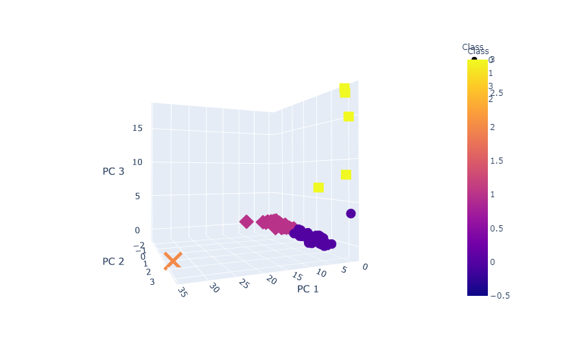
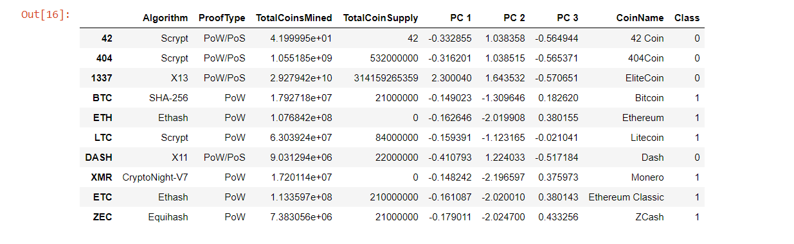

# Cryptocurrencies

# Overview
The purpose of this analysis is to provide information to investors considering investing in cryptocurrencies. We use unsupervised machine learning to analyze a dataset of cryptocurrencies to discover patterns from the input data using the K-means algorithm. Principal component analysis was then applied to improve the efficiency of the model. 

# Results
The data cleaning process included dropping all currencies that were not actively traded, mined, or were without a working algorithm. This process more than halved our original dataset. Text variables were then transformed into binary values, and the data was scaled. Principal component analysis was performed to reduce the number of dimensions in our model, and an elbow-curve created to determine the ideal amount of clusters for our data. 

Shown below are a 3-D plot of the clusters of our cryptocurrencies, as well as a table with releveant information for each coin. The last column "Class" indicates the cluster each coin was assigned by our model. 

# Summary
With the relevant coins now clustered, we can explore and discover patterns that could be relevant for investment purposes, or to be used in a supervised machine learning model. 
